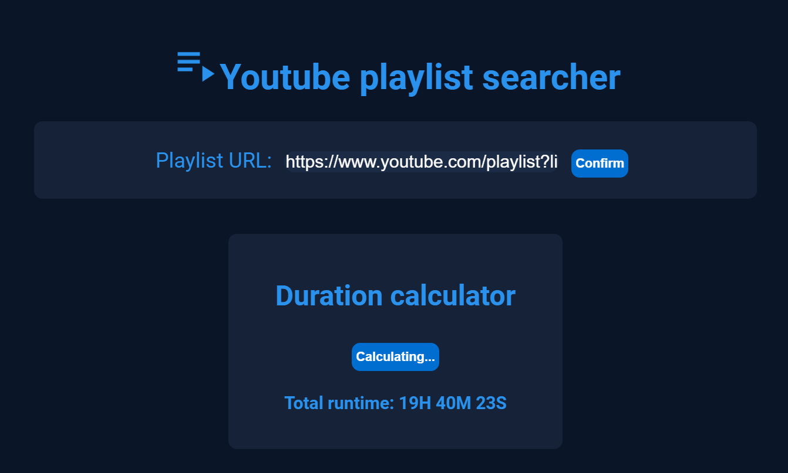
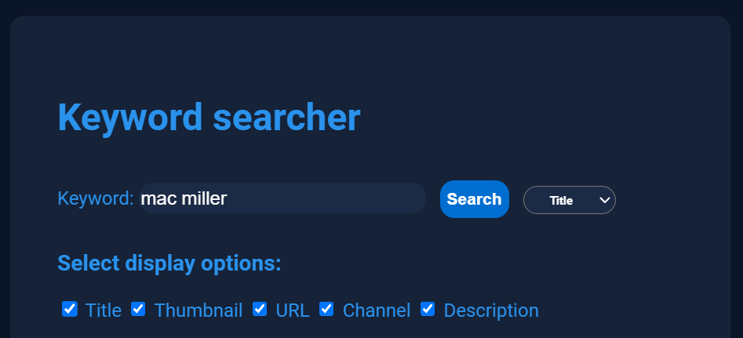
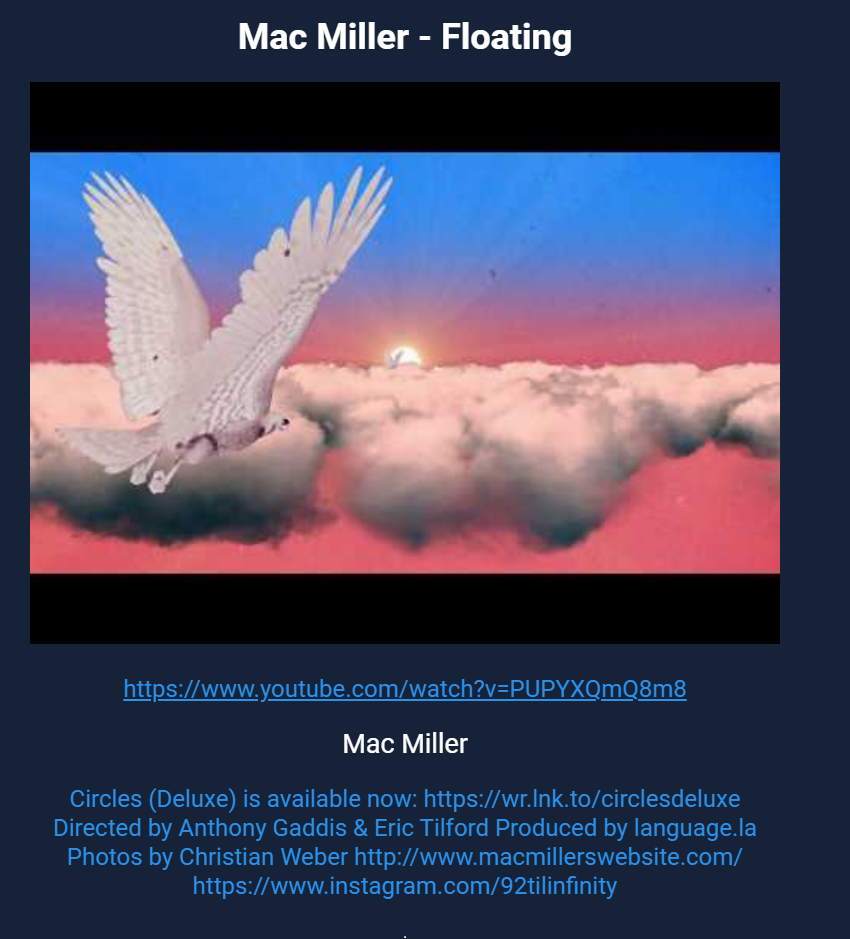
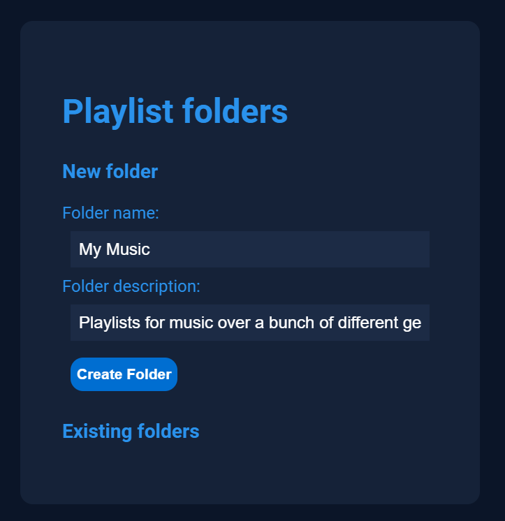
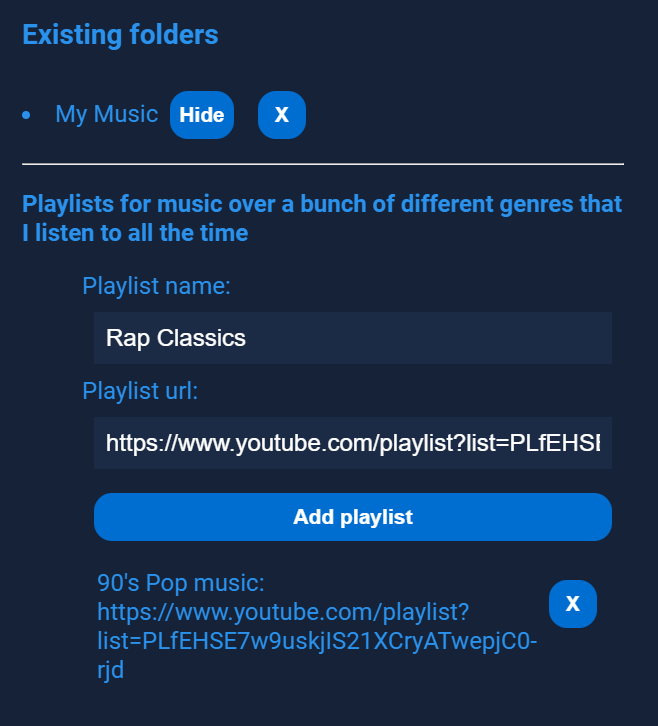

# Youtube Playlist Searcher

## Description
Provides utilities for youtube playlists that youtube itself doesn't have.

## Features
- ### Calculates the playlist's duration:
  
  
  
- ### Searches each video in the playlist for a keyword in the description, title or channel name:

  

  Result example:

  
  
  <i>(The rest of the results would follow under this)</i>
  
- ### Provides folders to organise playlists in.

After you have created the folder:

## How to use
- Paste the youtube playlist URL at the top of the page and click confirm.
- Ensure the playlist is public
